<!--
  Profile README for Akileswaran04
  Repo: github.com/Akileswaran04/Akileswaran04
  Theme: Cyber Cyan Terminal (#0d1117 bg, #22D3EE accent, #38BDF8 secondary)
-->

<!-- ASCII Portrait + Info Card side by side -->
<table>
<tr>
<td valign="top"></td>
<td valign="top"></td>
</tr>
</table>

 

<!-- Profile Views Counter -->

 

  

  

<!-- ========================================================================== -->
<!--  CYBER CYAN TERMINAL DASHBOARD — Everything below is the new redesign      -->
<!-- ========================================================================== -->

 

<!-- ─────────────────────────────────────────────────────────────────── -->
<!--  SYSTEM BANNER                                                      -->
<!-- ─────────────────────────────────────────────────────────────────── -->

<table align="center" bgcolor="#0d1117" border="1" bordercolor="#22D3EE" cellpadding="16" cellspacing="0" width="860">
<tr><td>

<pre>
┌─────────────────────────────────────────────────────────────┐
│  █████╗ ██╗  ██╗██╗██╗     ███████╗███████╗██╗    ██╗      │
│ ██╔══██╗██║ ██╔╝██║██║     ██╔════╝██╔════╝██║    ██║      │
│ ███████║█████╔╝ ██║██║     █████╗  █████╗  ██║ █╗ ██║      │
│ ██╔══██║██╔═██╗ ██║██║     ██╔══╝  ██╔══╝  ██║███╗██║      │
│ ██║  ██║██║  ██╗██║███████╗███████╗███████╗╚███╔███╔╝      │
│ ╚═╝  ╚═╝╚═╝  ╚═╝╚═╝╚══════╝╚══════╝╚══════╝ ╚══╝╚══╝       │
│                                                             │
│   ╔═══════════════════════════════════════════════════════╗  │
│   ║  PROFILE :: v2.4.1  │  STATUS: ONLINE  │  UPTIME: ∞  ║  │
│   ╚═══════════════════════════════════════════════════════╝  │
│                                                             │
│   [●] system ready — cyber cyan terminal initialized          │
└─────────────────────────────────────────────────────────────┘
</pre>

</td></tr>
</table>

 

<!-- ─────────────────────────────────────────────────────────────────── -->
<!--  $ whoami — IDENTITY PANEL                                        -->
<!-- ─────────────────────────────────────────────────────────────────── -->

<table align="center" bgcolor="#0d1117" border="1" bordercolor="#22D3EE" cellpadding="20" cellspacing="0" width="860">
<tr><td>

<pre>│ akileswaran04@github:~$ whoami
│
│ NAME     :: <b>Akileswaran A</b>
│ TITLE    :: Software Engineering Intern · Full-Stack &amp; Applied ML
│ LOCATION :: CEG, Anna University · B.Tech IT
│ STATUS   :: ● actively building
│ FOCUS    :: Multi-agent AI systems · Full-stack development · Applied ML
│
│ akileswaran04@github:~$ _
</pre>

</td></tr>
</table>

 

<!-- ─────────────────────────────────────────────────────────────────── -->
<!--  $ netstat --connections — SOCIAL LINKS                             -->
<!-- ─────────────────────────────────────────────────────────────────── -->

<table align="center" bgcolor="#0d1117" border="1" bordercolor="#22D3EE" cellpadding="20" cellspacing="0" width="860">
<tr><td>

<pre>│ akileswaran04@github:~$ netstat --connections
│
│ PROTOCOL  │ ADDRESS              │ STATUS
│ ────────── ┼ ───────────────────── ┼ ──────────
│ linkedin  │ <a href="https://linkedin.com/in/akileswaran-ammamuthu">/in/akileswaran-ammamuthu</a>  │ ● active
│ github    │ <a href="https://github.com/Akileswaran04">/Akileswaran04</a>              │ ● active
│ leetcode  │ <a href="https://leetcode.com/u/Akileswaran04/">/u/Akileswaran04</a>            │ ● active
│ sentri    │ <a href="https://sentri-final.streamlit.app">sentri-final.streamlit.app</a>   │ ● deployed
</pre>

</td></tr>
</table>

 

<!-- ─────────────────────────────────────────────────────────────────── -->
<!--  $ dpkg --list — TECH STACK                                         -->
<!-- ─────────────────────────────────────────────────────────────────── -->

<table align="center" bgcolor="#0d1117" border="1" bordercolor="#22D3EE" cellpadding="20" cellspacing="0" width="860">
<tr><td>

<pre>│ akileswaran04@github:~$ dpkg --list | grep -E 'lang|framework|tool'
│
│ LANGUAGES     │   
│ FRONTEND      │  
│ BACKEND       │   
│ DATABASE      │  
│ ML / AI       │    
│ TOOLS         │  
</pre>

</td></tr>
</table>

 

<!-- ─────────────────────────────────────────────────────────────────── -->
<!--  $ cat /proc/projects — FEATURED PROJECTS                          -->
<!-- ─────────────────────────────────────────────────────────────────── -->

<table align="center" bgcolor="#0d1117" border="1" bordercolor="#22D3EE" cellpadding="20" cellspacing="0" width="860">
<tr><td>

<pre>│ akileswaran04@github:~$ cat /proc/projects
│
│ ┌─── PROJECT DATABASE ───────────────────────────────────────────┐
│ │ ID  │ NAME           │ STACK                           │ STATUS    │
│ ├───┼─────────────────┼─────────────────────────────────┼───────────┤
│ │ 01 │ ODYSSEY         │ LLM · EBM · LangChain            │ ● build   │
│ │ 02 │ <a href="https://sentri-final.streamlit.app">SENTRI ▸</a>       │ Streamlit · FastAPI · XGBoost     │ ● live    │
│ │ 03 │ Gridlock         │ LightGBM · XGBoost · Hackathon   │ ○ archive │
│ │ 04 │ <a href="https://csau.vercel.app">Riddle Rush ▸</a>   │ React · Three.js · Supabase      │ ● live    │
│ │ 05 │ DayLog           │ React · Node.js · Firebase        │ ○ pending │
│ └───┴─────────────────┴─────────────────────────────────┴───────────┘
</pre>

</td></tr>
</table>

 

<!-- ─────────────────────────────────────────────────────────────────── -->
<!--  $ cat /proc/stats — GITHUB STATISTICS                              -->
<!-- ─────────────────────────────────────────────────────────────────── -->

<table align="center" bgcolor="#0d1117" border="1" bordercolor="#22D3EE" cellpadding="20" cellspacing="0" width="860">
<tr><td>

<pre>│ akileswaran04@github:~$ cat /proc/stats
│
│ ┌──────────────┬────────────────────────────────────────────────┐
│ │ REPOSITORY    │ STATISTICS                                    │
│ ├──────────────┼────────────────────────────────────────────────┤
│ │ Profile       │  │
│ │ Streak        │  │
│ └──────────────┴────────────────────────────────────────────────┘
</pre>

</td></tr>
</table>

 

<!-- ─────────────────────────────────────────────────────────────────── -->
<!--  $ ps aux — ACTIVE PROCESSES (Currently Building)                   -->
<!-- ─────────────────────────────────────────────────────────────────── -->

<table align="center" bgcolor="#0d1117" border="1" bordercolor="#22D3EE" cellpadding="20" cellspacing="0" width="860">
<tr><td>

<pre>│ akileswaran04@github:~$ ps aux --sort=-cpu | head -6
│
│ PID  │ PROCESS              │ STACK                                │ CPU%  │
│ ──── ┼ ──────────────────── ┼ ─────────────────────────────────── ┼ ───── │
│ 001 │ SENTRI               │ Streamlit · FastAPI · XGBoost          │ 42%  │
│ 002 │ Riddle Rush          │ React · Three.js · Supabase           │ 35%  │
│ 003 │ DayLog               │ React · Node.js · Firebase            │ 23%  │
</pre>

</td></tr>
</table>

 

<!-- ─────────────────────────────────────────────────────────────────── -->
<!--  $ echo — TAGLINE                                                   -->
<!-- ─────────────────────────────────────────────────────────────────── -->

<table align="center" bgcolor="#0d1117" border="1" bordercolor="#22D3EE" cellpadding="20" cellspacing="0" width="860">
<tr><td>

<pre>│ akileswaran04@github:~$ echo $TAGLINE
│
│ $TAGLINE = "Full-Stack × AI/ML — turning data into decisions"
</pre>

 

</td></tr>
</table>

 

<!-- ─────────────────────────────────────────────────────────────────── -->
<!--  FOOTER — System Status                                             -->
<!-- ─────────────────────────────────────────────────────────────────── -->

<table align="center" bgcolor="#0d1117" border="1" bordercolor="#22D3EE" cellpadding="12" cellspacing="0" width="860">
<tr><td>

<pre>┌────────────────────────────────────────────────────────────────────────────┐
│  ● profile.github — systemd (1) — ● active (running)              │
│                                                                            │
│    ├─ portrait    → avi-ascii.svg     [auto-generated from photo]      │
│    ├─ heatmap     → contrib-heatmap.svg [refreshes every 6h via GHA]     │
│    ├─ typewriter  → typewriter-card.svg  [countdown engine]           │
│    ├─ info-card   → info-card.svg       [experience &amp; highlights]       │
│    └─ drone       → contrib-heatmap.svg [stop-and-shoot animation]        │
│                                                                            │
│                             │
│                                                                            │
│  ● last generated: 2026-07-24  ·  theme: cyber-cyan-terminal  ·  v2.4.1    │
└────────────────────────────────────────────────────────────────────────────┘
</pre>

</td></tr>
</table>

 
