<!--
  Profile README for Akileswaran04
  Repo: github.com/Akileswaran04/Akileswaran04
-->

<div align="center">

<!-- ASCII Portrait + Info Card side by side -->
<table>
<tr>
<td valign="top"></td>
<td valign="top"></td>
</tr>
</table>

<!-- Name & Title -->
## AKILESWARAN A

**Software Engineering Intern Candidate · Full-Stack & Applied ML**

<!-- Contact & Social Badges -->
<a href="https://linkedin.com/in/akileswaran-ammamuthu"></a>
<a href="https://github.com/Akileswaran04"></a>
<a href="https://leetcode.com/u/Akileswaran04/"></a>
<a href="https://sentri-final.streamlit.app"></a>

<br>

<!-- Tech Stack -->
### 🛠️ Tech Stack

&nbsp;
&nbsp;
&nbsp;
&nbsp;
&nbsp;
&nbsp;
&nbsp;
&nbsp;
&nbsp;
&nbsp;
&nbsp;


<br><br>

<!-- About Section -->
### 👨‍💻 About Me

```
B.Tech IT student @ CEG, Anna University
Passionate about full-stack development, applied ML, and building
real-world systems that solve meaningful problems.

Currently exploring multi-agent AI systems and workflow automation.
```

<br>

<!-- Featured Projects -->
### 📌 Featured Projects

<table>
<tr>
<td width="50%">
<h3 align="center">ODYSSEY</h3>
<p align="center">Multi-Agent AI System for Fintech<br>
<em>SBI YONO · EBM · LLM Orchestration</em></p>
</td>
<td width="50%">
<h3 align="center"><a href="https://sentri-final.streamlit.app">SENTRI 🚀</a></h3>
<p align="center">Parking Enforcement Intelligence Dashboard<br>
<em>Streamlit · FastAPI · ML Forecasting</em></p>
</td>
</tr>
<tr>
<td width="50%">
<h3 align="center">Gridlock</h3>
<p align="center">Traffic Demand Forecasting<br>
<em>LightGBM · XGBoost · Hackathon</em></p>
</td>
<td width="50%">
<h3 align="center"><a href="https://csau.vercel.app">Riddle Rush 🚀</a></h3>
<p align="center">3D Trivia Board Game<br>
<em>React · Three.js · Supabase</em></p>
</td>
</tr>
</table>

<br>

<!-- GitHub Stats (using reliable badge counter instead of github-readme-stats API) -->


<br>



<br><br>

<sub>⚡ Profile art auto-generated — portrait SVGs refresh when source photo changes, contribution data refreshes every 6 hours via GitHub Actions.</sub>

</div>

<!-- ========================================================================== -->
<!--  NEW SECTIONS — Added below this line                                     -->
<!-- ========================================================================== -->

<br>

<!-- 2. GitHub Stats + Streak Stats (side-by-side, custom neon palette) -->
<div align="center" style="border: 1px solid #30363d; border-radius: 12px; padding: 24px 20px 20px; margin-bottom: 24px; background: #0d1117; text-align: center;">

### 📊 GitHub Stats

<table>
<tr>
  <td>
    
  </td>
  <td>
    
  </td>
</tr>
</table>

</div>

<br>

<!-- 3. Skill Icons (clickable, from skillicons.dev) -->
<div align="center" style="border: 1px solid #30363d; border-radius: 12px; padding: 24px 20px 20px; margin-bottom: 24px; background: #0d1117; text-align: center;">

### 🧰 Skills & Tools

<p align="center">
  <a href="https://react.dev" target="_blank"></a>&nbsp;
  <a href="https://nodejs.org" target="_blank"></a>&nbsp;
  <a href="https://firebase.google.com" target="_blank"></a>&nbsp;
  <a href="https://www.postgresql.org" target="_blank"></a>&nbsp;
  <a href="https://www.python.org" target="_blank"></a>&nbsp;
  <a href="https://www.tensorflow.org" target="_blank"></a>&nbsp;
  <a href="https://pytorch.org" target="_blank"></a>&nbsp;
  <a href="https://scikit-learn.org" target="_blank"></a>&nbsp;
  <a href="https://fastapi.tiangolo.com" target="_blank"></a>&nbsp;
</p>

</div>

<br>

<!-- 4. Collapsible "Currently Building" section -->
<div align="center" style="border: 1px solid #30363d; border-radius: 12px; padding: 24px 20px 20px; margin-bottom: 24px; background: #0d1117; text-align: center;">

### 🔨 Currently Building

<details>
  <summary>Click to expand — projects in the works</summary>

  <br>

  - **SENTRI** — Parking Enforcement Intelligence Dashboard <br>
    `Streamlit · FastAPI · ML Forecasting · XGBoost`

  - **Riddle Rush (CSAU Project)** — Multiplayer 3D Trivia Board Game <br>
    `React · Three.js · Socket.io · Supabase`

  - **DayLog** — Real-Time Attendance Tracking System <br>
    `React · Node.js · Firebase`

  <br>
</details>

</div>

<br>

<!-- 5. Typing Animation Header (rotating tagline via readme-typing-svg) -->
<div align="center" style="border: 1px solid #30363d; border-radius: 12px; padding: 24px 20px 20px; margin-bottom: 24px; background: #0d1117; text-align: center;">

### ⚡ Tagline

<p align="center">
  <a href="https://github.com/Akileswaran04">
    
  </a>
</p>

</div>
