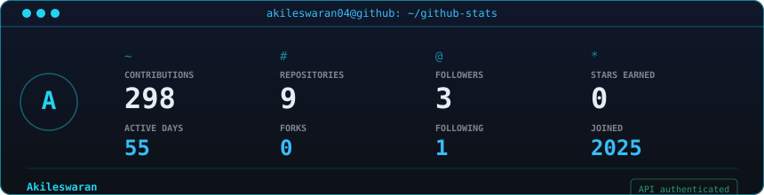
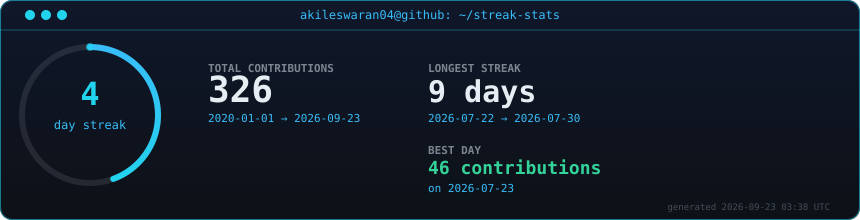

<!--
  Profile README for Akileswaran04
  Repo: github.com/Akileswaran04/Akileswaran04
  Theme: Cyber Cyan Terminal — matching the SVG heatmap (#0d1117 bg, #22D3EE accent, #38BDF8 secondary)
-->

<!-- ASCII Portrait + Info Card side by side -->
<table>
<tr>
<td valign="top"></td>
<td valign="top"></td>
</tr>
</table>

 

<!-- Profile Views Counter -->

 

 

 

<!-- ========================================================================== -->
<!--  Below: liquid-glass panels — generated by scripts/render_glass_cards.py  -->
<!-- ========================================================================== -->

 

  <pre>
│ akileswaran04@github:~$ github-stats
</pre>

 

  

  

  

  

  

