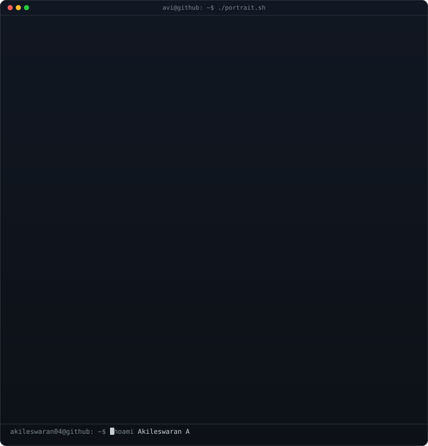
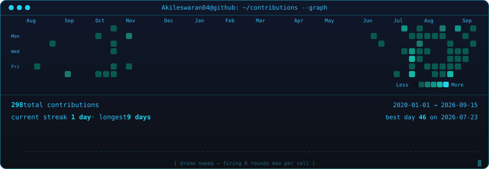
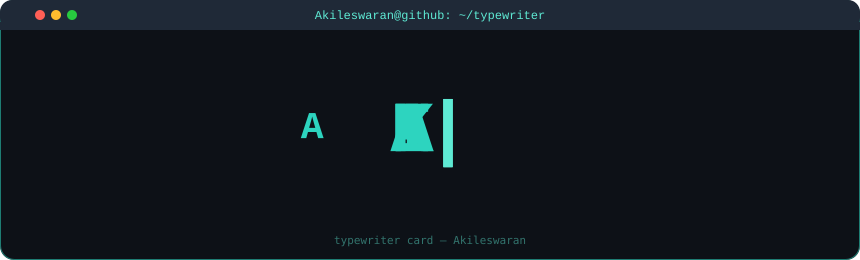

<!--
  Profile README for Akileswaran04
  Repo: github.com/Akileswaran04/Akileswaran04
  Theme: Cyber Cyan Terminal — matching the SVG heatmap (#0d1117 bg, #22D3EE accent, #38BDF8 secondary)
-->

<!-- ASCII Portrait + Info Card side by side -->
<table>
<tr>
<td valign="top"></td>
<td valign="top"></td>
</tr>
</table>

 

<!-- Profile Views Counter -->

 

  

  

<!-- ========================================================================== -->
<!--  Below: consistent card system — uniform styling, no box-drawing chars     -->
<!-- ========================================================================== -->

 

<!-- ── CARD: CONNECT ────────────────────────────────────────────────────── -->
<table align="center" bgcolor="#0f172a" border="1" bordercolor="#22D3EE" cellpadding="18" cellspacing="0" width="860" style="border-radius:8px">
<tr><td>

<h3 align="center">🔗 Connect</h3>

 

&nbsp;
&nbsp;
&nbsp;

</td></tr>
</table>

 

<!-- ── CARD: PROJECTS ───────────────────────────────────────────────────── -->
<table align="center" bgcolor="#0f172a" border="1" bordercolor="#22D3EE" cellpadding="18" cellspacing="0" width="860" style="border-radius:8px">
<tr><td>

<h3 align="center">📌 Projects</h3>

 

<table width="100%" cellpadding="6" cellspacing="0">
<tr><th align="left">ID</th><th align="left">Name</th><th align="left">Stack</th><th align="left">Status</th></tr>
<tr><td>01</td><td><b>ODYSSEY</b></td><td>LLM · EBM · LangChain</td><td>○ processing</td></tr>
<tr><td>02</td><td><a href="https://sentri-final.streamlit.app"><b>SENTRI ▸</b></a></td><td>Streamlit · FastAPI · XGBoost</td><td>● live</td></tr>
<tr><td>03</td><td><b>Gridlock</b></td><td>LightGBM · XGBoost · Hackathon</td><td>○ archive</td></tr>
<tr><td>04</td><td><a href="https://csau.vercel.app"><b>Riddle Rush ▸</b></a></td><td>React · Three.js · Supabase</td><td>● live</td></tr>
<tr><td>05</td><td><b>DayLog</b></td><td>React · Node.js · Firebase</td><td>✓ done</td></tr>
</table>

</td></tr>
</table>

 

<!-- ── CARD: GITHUB STATS ───────────────────────────────────────────────── -->
<table align="center" bgcolor="#0f172a" border="1" bordercolor="#22D3EE" cellpadding="18" cellspacing="0" width="860" style="border-radius:8px">
<tr><td>

<h3 align="center">📊 GitHub Stats</h3>

 

&nbsp;&nbsp;

</td></tr>
</table>

 

<!-- ── CARD: STACK ──────────────────────────────────────────────────────── -->
<table align="center" bgcolor="#0f172a" border="1" bordercolor="#22D3EE" cellpadding="18" cellspacing="0" width="860" style="border-radius:8px">
<tr><td>

<h3 align="center">🛠️ Stack</h3>

 

&nbsp;
&nbsp;
&nbsp;
&nbsp;
&nbsp;
&nbsp;
&nbsp;
&nbsp;
&nbsp;
&nbsp;
&nbsp;
&nbsp;
&nbsp;
&nbsp;
&nbsp;

</td></tr>
</table>

 

<!-- ── CARD: BUILDING NOW ──────────────────────────────────────────────── -->
<table align="center" bgcolor="#0f172a" border="1" bordercolor="#22D3EE" cellpadding="18" cellspacing="0" width="860" style="border-radius:8px">
<tr><td>

<h3 align="center">🚧 Building now</h3>

 

<table width="100%" cellpadding="6" cellspacing="0">
<tr><th align="left">PID</th><th align="left">Process</th><th align="left">Stack</th><th align="left">CPU</th></tr>
<tr><td>001</td><td><b>SENTRI</b></td><td>Streamlit · FastAPI · XGBoost</td><td>42%</td></tr>
<tr><td>002</td><td><b>Riddle Rush</b></td><td>React · Three.js · Supabase</td><td>35%</td></tr>
<tr><td>003</td><td><b>ODYSSEY</b></td><td>LLM · EBM · LangChain</td><td>38%</td></tr>
</table>

</td></tr>
</table>

 

<!-- ── CARD: TAGLINE ───────────────────────────────────────────────────── -->
<table align="center" bgcolor="#0f172a" border="1" bordercolor="#22D3EE" cellpadding="18" cellspacing="0" width="860" style="border-radius:8px">
<tr><td>

<h3 align="center">💬 Tagline</h3>

 

</td></tr>
</table>

 

  
  ● profile.github — systemd (1) — ● active (running)  
  ├─ portrait → avi-ascii.svg  ├─ heatmap → contrib-heatmap.svg  
  ├─ typewriter → typewriter-card.svg  ├─ info-card → info-card.svg  
  └─ drone → contrib-heatmap.svg  
    
  ● last generated: 2026-07-24 · v3.0.0
  

 

  

 
