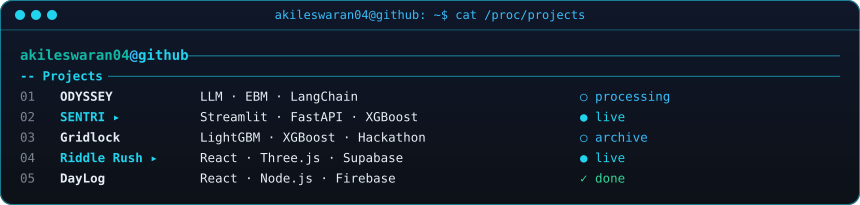
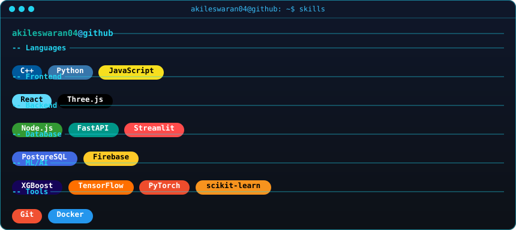
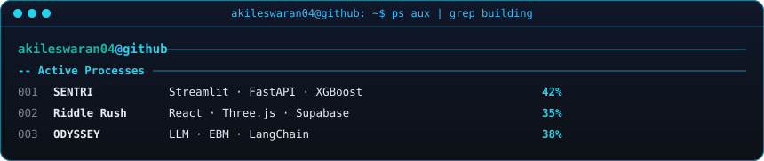
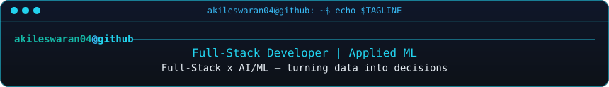

<!--
  Profile README for Akileswaran04
  Repo: github.com/Akileswaran04/Akileswaran04
  Theme: Cyber Cyan Terminal — matching the SVG heatmap (#0d1117 bg, #22D3EE accent, #38BDF8 secondary)
-->

<!-- ASCII Portrait + Info Card side by side -->
<table>
<tr>
<td valign="top"></td>
<td valign="top"></td>
</tr>
</table>

 

<!-- Profile Views Counter -->

 

 

 

<!-- ========================================================================== -->
<!--  Below: liquid-glass panels — generated by scripts/render_glass_cards.py  -->
<!-- ========================================================================== -->

 

 

<table align="center" bgcolor="#0d1117" border="1" bordercolor="#22D3EE" cellpadding="24" cellspacing="0" width="860" style="border-radius:12px">
<tr><td>

<pre>│ akileswaran04@github:~$ github-stats
</pre>

 

  

</td></tr>
</table>

 

 

 

 

